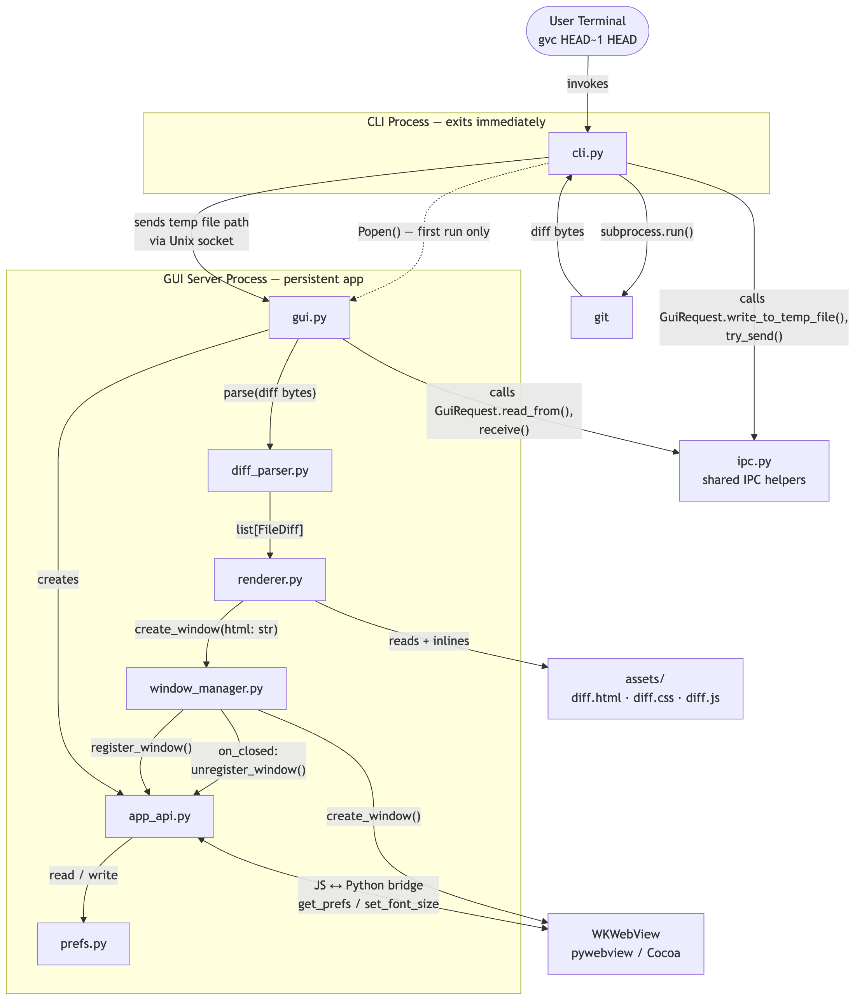
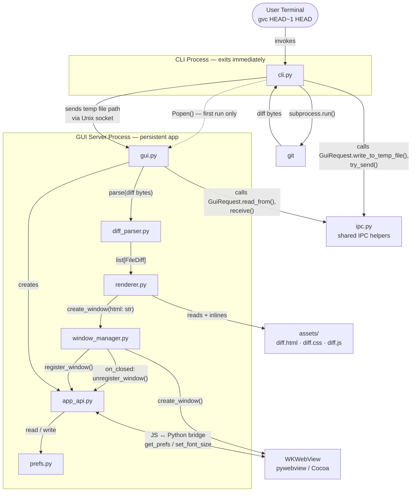

## How It Works

The first `gvc` invocation launches a persistent background process that owns all diff windows (one Dock icon, no matter how many windows). Subsequent invocations connect to the running process via a Unix domain socket and ask it to open a new window. The process stays alive after all windows are closed, so the next `gvc` call opens instantly.

Diffs are rendered as self-contained HTML with inlined CSS and JS; no HTTP server, no network access required.

## Components

## Module Responsibilities

| Module | Role |
|---|---|
| `cli.py` | Entry point. Runs `git diff`, hands off via IPC. Never blocks. |
| `gui.py` | Long-lived server process. Binds socket, owns the Cocoa event loop. |
| `ipc.py` | Stateless IPC helpers: socket path, temp file read/write, socket send. |
| `diff_parser.py` | Parses unified diff bytes → `list[FileDiff]` dataclass tree. |
| `renderer.py` | Converts `list[FileDiff]` → self-contained HTML string. Loads assets once, caches. |
| `window_manager.py` | Creates pywebview windows. Handles screen geometry, cascading stacking (based on existing open windows), focus. |
| `app_api.py` | JS↔Python bridge. Single instance shared across all windows. Handles font size (with broadcast). Tracks open window list. |
| `prefs.py` | Persistent JSON settings. Currently stores `font_size` only. Atomic writes via `fcntl` + `os.replace`. |
| `assets/diff.html` | Shell template with `/* INLINE_CSS */`, `<!-- OUTLINE_HTML -->` etc. placeholders. |
| `assets/diff.css` | All theming. Light/dark via CSS custom properties + `@media prefers-color-scheme`. |
| `assets/diff.js` | Find bar, keyboard shortcuts, font size, collapse/expand, wrap-around flash. |

## Persisted Data

| What | Path |
|---|---|
| Prefs | `~/Library/Application Support/gvc/prefs.json` (`user_data_dir`) |
| Logs | `~/Library/Logs/gvc/gvc.log` (`user_log_dir`) |
| Socket | `~/Library/Caches/TemporaryItems/gvc/gui.sock` (`user_runtime_dir`) |
| GUI Request | `/var/folders/vm/A/T/B.gvc` (`NamedTemporaryFile`) |

The `platformdirs` module is used to locate many of these paths.

## Notable Design Choices

- **No HTTP server** — `load_html()` with fully inlined CSS/JS; no network port needed
- **Socket bound before webview import** — minimises race window for concurrent CLI invocations
- **Hidden keepalive window** — keeps the Cocoa event loop alive after all diff windows close
- **Window geometry from live state** — cascading position/size derived from `api.open_windows()` at creation time, not persisted to disk
- **CSS media query dark mode** — no JS polling; WKWebView reacts to system appearance change live
- **`
`/`
`** — collapsible file sections with zero JS required for the toggle itself
- **`os.fork()` explicitly avoided** — incompatible with Cocoa; subprocess is used instead
